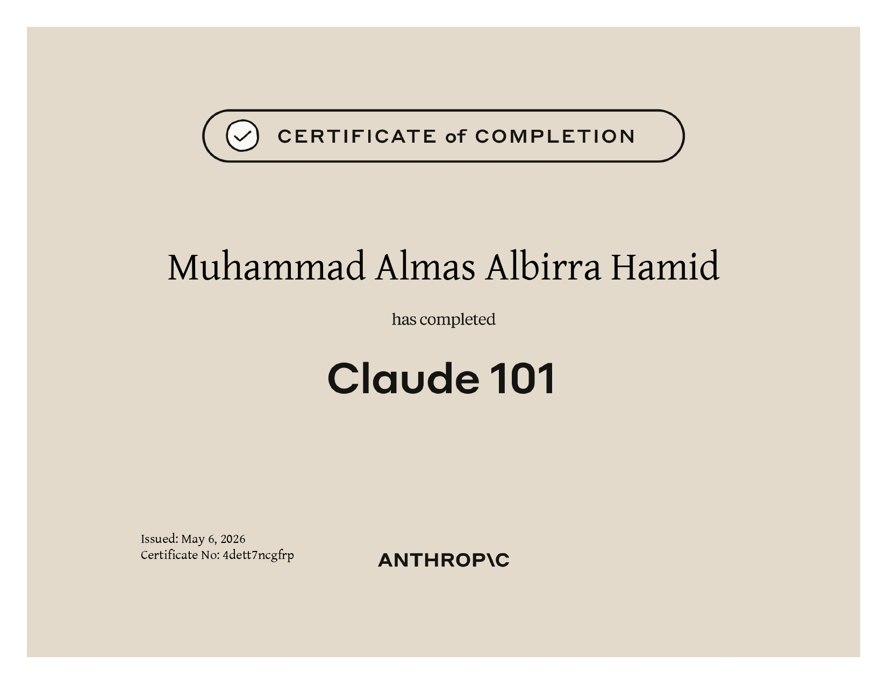
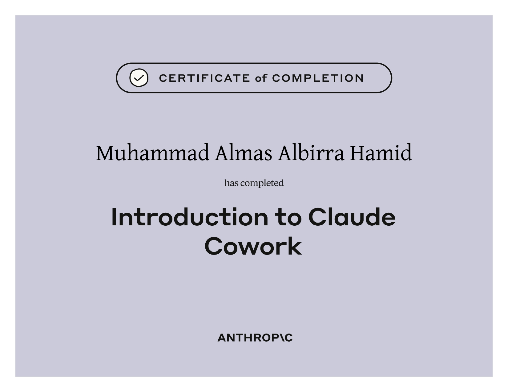
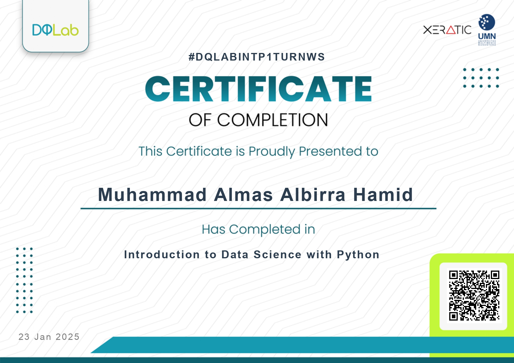
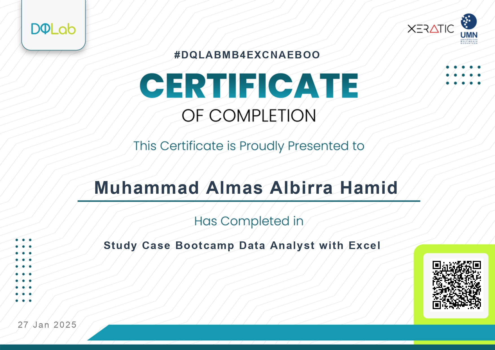
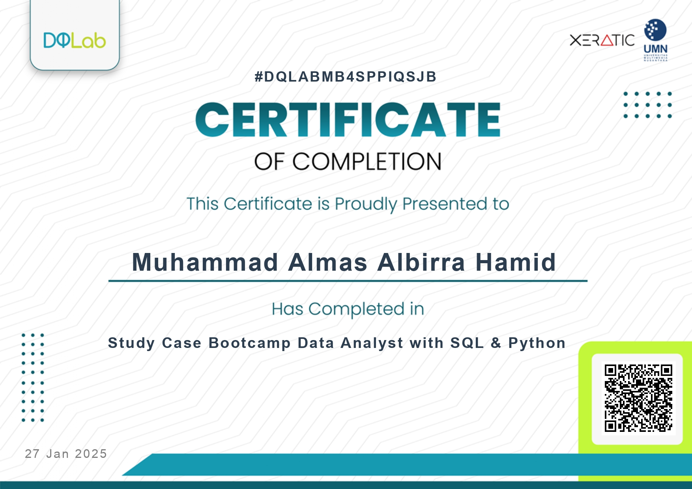
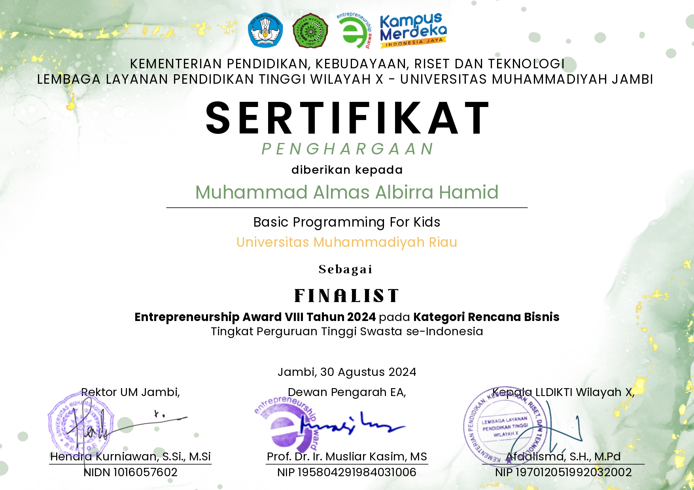

<h1 align="center">Muhammad Almas Albirra Hamid</h1>

<p align="center">
  <b>AI Engineer • Computer Vision • Machine Learning • Full Stack Developer • IoT Engineer</b>
</p>

<p align="center">
  
</p>

<p align="center">
  
  
  
  
</p>

<p align="center">
  <a href="mailto:seriesmomoru@gmail.com"></a>
  <a href="https://www.linkedin.com/in/muhammad-almas-albirra-hamid-3812202b8"></a>
  <a href="https://x.com/Mr_Momoru"></a>
  <a href="https://discord.com/users/monarch7894"></a>
</p>

<br>

## About

I build systems at the intersection of **Artificial Intelligence, Computer Vision, and Software Engineering** — from training and deploying models to shipping the full stack products that put them in front of users. My work spans object detection and image classification, time-series forecasting, and IoT-connected applications, backed by a Full Stack background in Laravel and Next.js.

I'm an Informatics Engineering student at **Universitas Muhammadiyah Riau**, currently focused on applied AI research and open-source tooling that bridges the gap between machine learning models and production-ready software.

<br>

## Current Focus

```text
🔭  Building OpenReframe — an open-source AI platform powered by YOLO
🌦️  Weather Risk Prediction using NASA POWER / NOAA data with Prophet + SVM
🩺  Medical Image Classification with TensorFlow, Keras & ResNet50
🌐  ProtoKarya — Full Stack + IoT product built on Laravel & Next.js
📖  Deepening research in Transfer Learning & Time-Series Forecasting
```

<br>

## Technical Expertise

<table>
<tr>
<td valign="top" width="50%">

**Artificial Intelligence & Computer Vision**
- Machine Learning & Deep Learning fundamentals
- Computer Vision with OpenCV, YOLO
- CNNs, Transfer Learning, ResNet50
- Model training with TensorFlow & Keras

**Data Science**
- Data preprocessing & feature engineering
- Forecasting with Prophet
- Support Vector Machine (SVM)
- Exploratory analysis with Python

</td>
<td valign="top" width="50%">

**Full Stack Development**
- Laravel, PHP, REST API design
- Next.js for modern web interfaces
- MySQL database design
- Git-based collaborative workflows

**IoT & Embedded Systems**
- Arduino & ESP32 development
- LoRa-based communication
- Sensor integration for real-world data
- Hardware ↔ software product design

</td>
</tr>
</table>

<br>

## Tech Stack

**Artificial Intelligence**


`TensorFlow` `Keras` `YOLO` `OpenCV` `Scikit-Learn` `NumPy` `Pandas` `Matplotlib`

**Frontend**


**Backend & Database**


**IoT**


`ESP32` `Arduino` `LoRa` `MQTT`

**Developer Tools**


<br>

## Featured Projects

| Project | Description | Stack |
|---|---|---|
| 🧠 **OpenReframe** | Open-source AI platform for object detection and visual analysis | YOLO · Python · OpenCV |
| 🌦️ **Weather Risk Prediction** | Forecasting weather-related risk using NASA POWER & NOAA datasets | Prophet · SVM · Python |
| 🩺 **Medical Image Classification** | Classifying medical imagery with transfer learning | TensorFlow · Keras · ResNet50 |
| 🌐 **ProtoKarya** | IoT-integrated full stack product for real-world innovation | Laravel · Next.js · ESP32 |

<br>

## Achievements

| Award | Event | Year |
|---|---|---|
| 🥈 2nd Place — Business Poster & Pitching Competition (Project: ProtoKarya) | Liga Talenta Mahasiswa Indonesia — LLDIKTI XVII | 2026 |
| 🏅 Finalist | Entrepreneurship Award VIII | 2024 |

<br>

## Certifications

<!--
  MAINTENANCE NOTE — cara update galeri sertifikat ini:
  1. Rename file screenshot sertifikat kamu sesuai daftar di bawah, lalu taruh
     di folder:  assets/certificates/  (di root repo profile README ini)
  2. Kalau nama/urutan sertifikat di captionnya kurang pas, tinggal edit teks
     <sub>...</sub> di bawah tiap  — tidak perlu ubah struktur tabel.

  Mapping nama file asli (dari folder D:\sertiv) -> nama file baru di assets/certificates/:
    certificate-4dett7ncgfrp-1778136653_page-0001.jpg      -> claude-101.jpg
    certificate-byszqhsh6xhb-1780673263_page-0001.jpg      -> intro-claude-cowork.jpg
    certificate-DQLABAI001CCLGIP_page-0001.jpg             -> dqlab-python-with-ai.jpg
    certificate-DQLABAI002TTVRRR with Ai_page-0001.jpg     -> dqlab-sql-with-ai.jpg
    certificate-DQLABAI003RRCEWU_page-0001.jpg             -> dqlab-r-with-ai.jpg
    certificate-DQLABBGINREBFGKUR_page-0001.jpg            -> dqlab-intro-data-science-python.jpg
    certificate-DQLABINTP1TURNWS_page-0001.jpg             -> dqlab-intro-data-science-r.jpg
    certificate-DQLABMB4EXCNAEBOexcel_page-0001.jpg        -> dqlab-data-analyst-excel.jpg
    Minibootcamp4 data analisis sql dqlb_page-0001.jpg     -> dqlab-data-analyst-sql-python.jpg
    Muhammad Almas Albirra Hamid_page-0001.jpg             -> sertifikat-lainnya.jpg  (cek ulang judul aslinya)
-->

<p align="center">
  <table>
    <tr>
      <td align="center" width="20%">
        <br/>
        <sub><b>Claude 101</b><br/>Anthropic</sub>
      </td>
      <td align="center" width="20%">
        <br/>
        <sub><b>Introduction to Claude Cowork</b><br/>Anthropic</sub>
      </td>
      <td align="center" width="20%">
        <br/>
        <sub><b>Guide to Learn Python with AI</b><br/>DQLab</sub>
      </td>
      <td align="center" width="20%">
        <br/>
        <sub><b>Guide to Learn SQL with AI</b><br/>DQLab</sub>
      </td>
      <td align="center" width="20%">
        <br/>
        <sub><b>Guide to Learn R with AI</b><br/>DQLab</sub>
      </td>
    </tr>
    <tr>
      <td align="center" width="20%">
        <br/>
        <sub><b>Intro to Data Science with Python</b><br/>DQLab</sub>
      </td>
      <td align="center" width="20%">
        <br/>
        <sub><b>Intro to Data Science with R</b><br/>DQLab</sub>
      </td>
      <td align="center" width="20%">
        <br/>
        <sub><b>Data Analyst with Excel</b><br/>DQLab</sub>
      </td>
      <td align="center" width="20%">
        <br/>
        <sub><b>Data Analyst with SQL & Python</b><br/>DQLab</sub>
      </td>
      <td align="center" width="20%">
        <br/>
        <sub><b>Sertifikat Lainnya</b><br/><i>(cek judul asli)</i></sub>
      </td>
    </tr>
  </table>
</p>

<br>

## GitHub Statistics

<p align="center">
  
  
</p>

<p align="center">
  
</p>

<p align="center">
  
</p>

<p align="center">
  <picture>
    <source media="(prefers-color-scheme: dark)" srcset="https://raw.githubusercontent.com/Momoru2002/Momoru2002/output/github-contribution-grid-snake-dark.svg">
    <source media="(prefers-color-scheme: light)" srcset="https://raw.githubusercontent.com/Momoru2002/Momoru2002/output/github-contribution-grid-snake.svg">
    
  </picture>
</p>

<br>

## Goals

- Publish OpenReframe as a stable, documented open-source release
- Deploy production-grade computer vision models beyond prototypes
- Contribute to open-source AI/ML tooling
- Expand ProtoKarya into a full IoT product line
- Publish technical write-ups on applied AI research

<br>

## Support My Work

<p align="center">
  <a href="https://saweria.co/Momoru19">
    
  </a>
</p>

<br>

<p align="center">
<i>"Good models don't ship themselves — good engineering does."</i>
</p>

<p align="center">
  <sub>Muhammad Almas Albirra Hamid · Informatics Engineering, Universitas Muhammadiyah Riau · Indonesia</sub>
</p>
