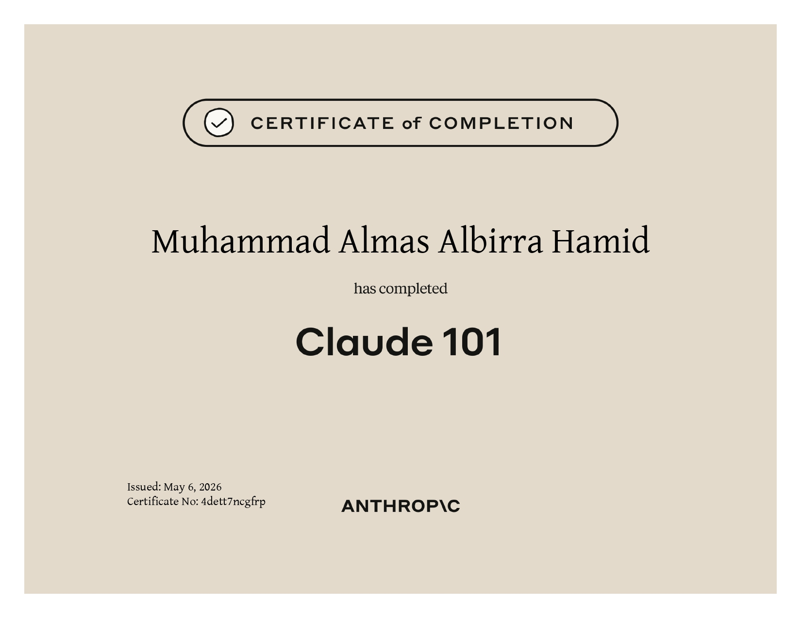
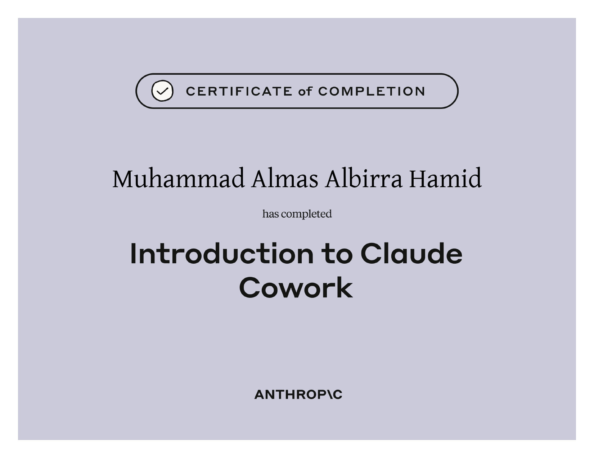
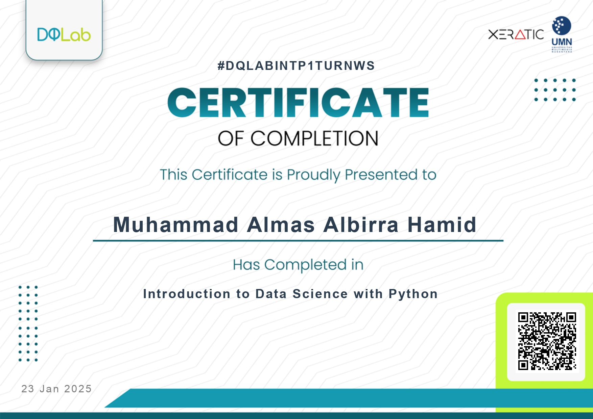
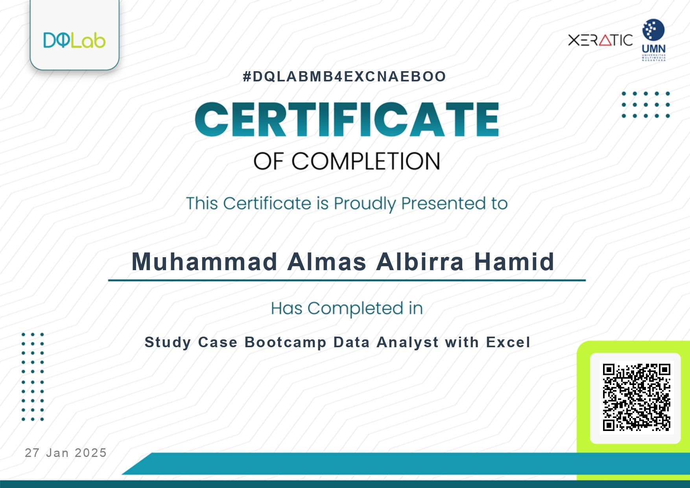
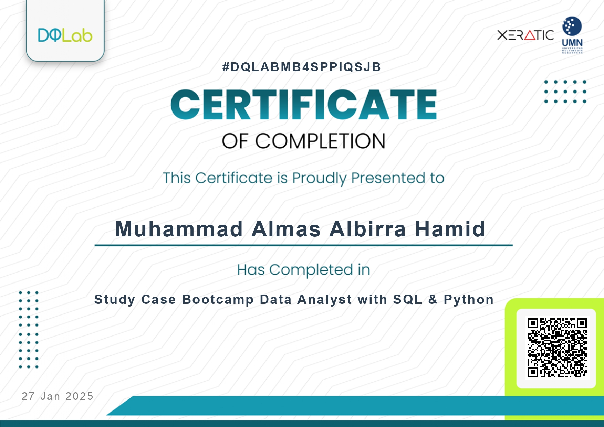
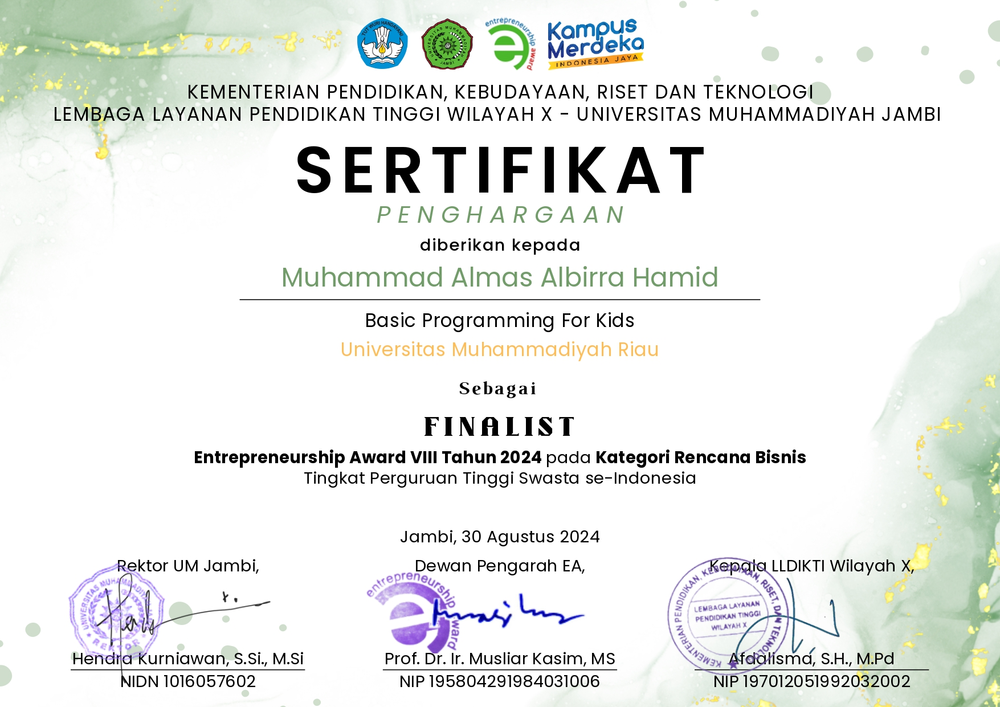

<h1 align="center">Muhammad Almas Albirra Hamid</h1>

<p align="center">
  <b>AI Engineer • Computer Vision • Efficient AI & Edge Deployment</b><br>
  <sub>Backed by Software Engineering, Networking, Cybersecurity & AIoT</sub>
</p>

<p align="center">
  
</p>

<p align="center">
  
  
  
  
</p>

<p align="center">
  <a href="mailto:seriesmomoru@gmail.com"></a>
  <a href="https://www.linkedin.com/in/muhammad-almas-albirra-hamid-3812202b8"></a>
  <a href="https://x.com/Mr_Momoru"></a>
  <a href="https://discord.com/users/monarch7894"></a>
</p>

<br>

## About

I build systems at the intersection of **Computer Vision, Efficient AI, and Software Engineering** — from training and optimizing detection models to shipping the APIs, databases, and infrastructure that put them into production. My primary focus is **efficient, real-time object detection**: training, evaluating, and optimizing YOLO-based models (quantization, pruning, benchmarking) toward edge deployment.

That work is backed by a full-stack engineering background (FastAPI, Laravel, Next.js) and a growing foundation in **Linux systems, networking, IoT, and cybersecurity/OSINT tooling** — because a model is only useful once it's running inside a real system: an API, a database, a server, a network, a device.

```
MODEL → CODE → API → DATABASE → SERVER → NETWORK → SECURITY → EDGE DEVICE
```

I'm an Informatics Engineering student at **Universitas Muhammadiyah Riau**, currently deepening applied AI research and open-source tooling that connects model development to the systems AI actually runs on.

<br>

## Current Focus

```text
AI            → Object detection, model evaluation, quantization & pruning experiments (YOLO)
Engineering   → PyTorch, FastAPI model-serving, Docker, MLflow experiment tracking
Deployment    → ONNX / TensorRT export, GPU inference, edge deployment workflows
Systems       → Linux, networking fundamentals, AIoT, server/VPS management
Security      → Ethical hacking & OSINT tooling, VPS hardening, recon automation
Research      → Reproducible experiments, benchmarking, ablation-style evaluation
```

**Shipping / recently shipped**
```text
🔭  Building OpenReframe — open-source AI-powered media reframing platform
🌴  Building AgroVision AI — CV platform for oil palm plantation monitoring
✅  Shipped Weather Risk Prediction — Sumatera (NASA POWER + NOAA, Prophet + SVM)
🌐  ProtoKarya Hub — full-stack platform for electronics/PCB prototyping services
🏢  Creativ Potlot — official company website (Next.js + Prisma)
🔐  Developing ethical hacking & OSINT tools for authorized security research
```

<br>

## Technical Expertise

<table>
<tr>
<td valign="top" width="50%">

**AI / Computer Vision**
- CNNs, image classification, transfer learning & fine-tuning
- Object detection with YOLO (Ultralytics) — dataset prep, annotation, training, validation, inference
- Model evaluation: precision, recall, mAP50, mAP50-95
- Grad-CAM / explainable AI
- TensorFlow, Keras · developing PyTorch
- Architecture comparison (ResNet50; exploring EfficientNetV2S, DenseNet121)

**Efficient AI & Model Optimization**
- FP32 / FP16 / INT8 quantization, magnitude pruning
- Latency, FPS, model size & GFLOPs benchmarking
- Baseline-vs-optimized model comparison
- Reproducible experiments (seeds, configs, experiment logging)
- Developing: knowledge distillation, ONNX, TensorRT, GPU inference

**AI Deployment & MLOps (developing)**
- FastAPI for model-serving backends
- Docker, Linux for packaging & serving
- MLflow for experiment tracking
- Building toward: monitoring, logging, end-to-end ML pipelines

**Classical AI & Research Foundations**
- Search & optimization: BFS/DFS, A*, heuristic search, TSP, graph coloring, genetic algorithms, simulated annealing
- Experimental method: hypotheses, baselines, ablation-style comparison, reproducibility

</td>
<td valign="top" width="50%">

**Software Engineering**
- Python, PHP, JavaScript/TypeScript, Dart, Bash, SQL
- OOP, REST API design, backend & frontend architecture, Git/GitHub
- Backend: FastAPI, Laravel, PostgreSQL, MySQL, Prisma, Supabase
- Frontend: Next.js, React, Tailwind CSS
- Mobile: Flutter / Dart

**Networking & Systems**
- TCP/IP, HTTP/HTTPS, REST & MQTT-based communication
- Linux networking, VPS provisioning & remote server management
- Developing: DNS, routing fundamentals, structured network troubleshooting, network security fundamentals

**Cybersecurity & OSINT**
- Reverse engineering & deobfuscation tooling (Obfuscope, ObfuscopeV2)
- OSINT automation & reconnaissance (Momoru-Hunter-V4)
- VPS/server hardening & security tooling (security-toolkit-vps)
- Python/Bash security scripting on Linux
- CTF-oriented, authorized security research

**AIoT / Edge Computing**
- Arduino, ESP32, LoRa, sensor integration
- Hardware ↔ software product design
- Developing: Raspberry Pi, NVIDIA Jetson, MQTT telemetry pipelines, edge inference, hardware-constrained optimization

</td>
</tr>
</table>

<br>

### Technical Maturity

```text
CORE
Computer Vision · Python · Object Detection (YOLO)
TensorFlow/Keras · Software Engineering · Git/GitHub

APPLIED
Transfer Learning · Fine-tuning · Grad-CAM · Model Evaluation
FastAPI · Docker · REST API · Laravel · Next.js · Linux
IoT Integration (Arduino/ESP32) · OSINT & Security Tooling

DEVELOPING
PyTorch · ONNX · TensorRT · Quantization · Pruning
Knowledge Distillation · MLOps · Edge AI · GPU Inference
Networking Fundamentals · AIoT (Jetson/Raspberry Pi/MQTT)
```

<br>

## Research Interests

Efficient object detection · model compression (quantization, pruning, distillation) · real-time computer vision · edge AI · explainable AI · AIoT · reproducible ML experiments · model benchmarking

*Supporting:* AI systems infrastructure · network-aware application design · cybersecurity automation

<br>

## Tech Stack

**AI / ML**


`Python` `TensorFlow` `Keras` `PyTorch (developing)` `Ultralytics/YOLO` `OpenCV` `Scikit-learn` `MLflow` `NumPy` `Pandas` `Matplotlib`

**AI Optimization / Deployment**

`ONNX (developing)` `TensorRT (developing)` `Docker` `FastAPI` `Linux` `GPU Inference (developing)`

**Programming**

`Python` `PHP` `JavaScript` `TypeScript` `Dart` `Bash` `SQL`

**Backend & Database**


`FastAPI` `Laravel` `PHP` `PostgreSQL` `MySQL` `Prisma` `Supabase`

**Frontend**


**Networking**

`TCP/IP` `HTTP/HTTPS` `REST` `MQTT` `Linux Networking` `VPS`

**Cybersecurity & OSINT**


`OSINT` `Reconnaissance` `Reverse Engineering` `Deobfuscation` `Python Security Scripting` `Server Hardening`

**IoT / Embedded**


`ESP32` `Arduino` `LoRa` `MQTT` `Raspberry Pi (developing)` `NVIDIA Jetson (developing)`

**Mobile**


**DevOps / Tools**


<br>

## Featured Projects

**AI / Computer Vision**

| Project | Description | Stack |
|---|---|---|
| 🌴 **[AgroVision AI](https://github.com/Momoru2002/AgroVision-AI)** | CV platform for oil palm plantation monitoring — FFB detection, ripeness & disease classification, harvest yield estimation, with an MLOps-oriented pipeline | YOLO · ResNet50 · FastAPI · Next.js 15 · PostgreSQL · MLflow · Docker |
| 🧠 **[OpenReframe](https://github.com/Momoru2002/OpenReframe)** | Open-source AI media reframing platform — smart aspect-ratio adaptation for images/video via a FastAPI + worker-queue backend | FastAPI · OpenCV · Redis/RQ · Next.js |
| 🩺 **[retinal-oct-classification](https://github.com/Momoru2002/retinal-oct-classification)** | Medical image classification on retinal OCT scans with deep learning | Jupyter Notebook · TensorFlow/Keras |
| 🌦️ **[Weather Risk Prediction — Sumatera](https://github.com/Momoru2002/Weather-Risk-Prediction-Sumatera)** | Weather risk forecasting for Sumatera using NASA POWER & NOAA GHCN data — Prophet forecasting + SVM risk classification (~96% accuracy) | Prophet · Scikit-learn (SVM) · Pandas · Python |

**Software Engineering**

| Project | Description | Stack |
|---|---|---|
| 🌐 **[ProtoKarya Hub](https://github.com/Momoru2002/ProtoKarya)** | Full-stack platform for an electronics/PCB prototyping business — PCB price configurator, guest/member ordering, order tracking, admin dashboard with analytics | Next.js 15 · Supabase (Postgres + Auth) · Tailwind CSS |
| 🏢 **[Creativ Potlot](https://github.com/Momoru2002/Creativ-Potlot)** | Official company website with bilingual (ID/EN) content, product & portfolio catalogs, RFQ/contact flow, admin dashboard | Next.js 15 · TypeScript · Prisma · PostgreSQL · next-intl |

**Cybersecurity / OSINT**

| Project | Description | Stack |
|---|---|---|
| 🔎 **[Obfuscope](https://github.com/Momoru2002/Obfuscope) / [ObfuscopeV2](https://github.com/Momoru2002/ObfuscopeV2)** | Universal deobfuscation & binary analysis toolkit — decoding, inspecting, and reversing encoded/obfuscated data with automatic detection | TypeScript |
| 🕵️ **[Momoru-Hunter-V4](https://github.com/Momoru2002/Momoru-Hunter-V4)** | Automated OSINT-based intelligence/detection system | Python |
| 🛡️ **[security-toolkit-vps](https://github.com/Momoru2002/security-toolkit-vps)** | Security toolkit for VPS/server hardening & monitoring | Python |

**Other**

| Project | Description | Stack |
|---|---|---|
| 📱 **[SITUMA](https://github.com/Momoru2002/SITUMA)** | Mobile app project *(description pending)* | Dart |

<br>

## Achievements

| Award | Event | Year |
|---|---|---|
| 🥈 2nd Place — Business Poster & Pitching Competition (Project: ProtoKarya) | Liga Talenta Mahasiswa Indonesia — LLDIKTI XVII | 2026 |
| 🏅 Finalist | Entrepreneurship Award VIII | 2024 |

<br>

## Certifications

<!--
  MAINTENANCE NOTE — cara update galeri sertifikat ini:
  1. Rename file screenshot sertifikat kamu sesuai daftar di bawah, lalu taruh
     di folder:  assets/certificates/  (di root repo profile README ini)
  2. Kalau nama/urutan sertifikat di captionnya kurang pas, tinggal edit teks
     <sub>...</sub> di bawah tiap  — tidak perlu ubah struktur tabel.

  Mapping nama file asli (dari folder D:\sertiv) -> nama file baru di assets/certificates/:
    certificate-4dett7ncgfrp-1778136653_page-0001.jpg      -> claude-101.jpg
    certificate-byszqhsh6xhb-1780673263_page-0001.jpg      -> intro-claude-cowork.jpg
    certificate-DQLABAI001CCLGIP_page-0001.jpg             -> dqlab-python-with-ai.jpg
    certificate-DQLABAI002TTVRRR with Ai_page-0001.jpg     -> dqlab-sql-with-ai.jpg
    certificate-DQLABAI003RRCEWU_page-0001.jpg             -> dqlab-r-with-ai.jpg
    certificate-DQLABBGINREBFGKUR_page-0001.jpg            -> dqlab-intro-data-science-python.jpg
    certificate-DQLABINTP1TURNWS_page-0001.jpg             -> dqlab-intro-data-science-r.jpg
    certificate-DQLABMB4EXCNAEBOexcel_page-0001.jpg        -> dqlab-data-analyst-excel.jpg
    Minibootcamp4 data analisis sql dqlb_page-0001.jpg     -> dqlab-data-analyst-sql-python.jpg
    Muhammad Almas Albirra Hamid_page-0001.jpg             -> sertifikat-lainnya.jpg  (cek ulang judul aslinya)
    [FILE SERTIFIKAT PROTOKARYA]                           -> protokarya.jpg
    [FILE SERTIFIKAT JUARA 2 LTMI]                         -> juara-2-ltmi.jpg
-->

<p align="center">
  <table>
    <tr>
      <td align="center" width="20%">
        <br/>
        <sub><b>Claude 101</b><br/>Anthropic</sub>
      </td>
      <td align="center" width="20%">
        <br/>
        <sub><b>Introduction to Claude Cowork</b><br/>Anthropic</sub>
      </td>
      <td align="center" width="20%">
        <br/>
        <sub><b>Guide to Learn Python with AI</b><br/>DQLab</sub>
      </td>
      <td align="center" width="20%">
        <br/>
        <sub><b>Guide to Learn SQL with AI</b><br/>DQLab</sub>
      </td>
      <td align="center" width="20%">
        <br/>
        <sub><b>Guide to Learn R with AI</b><br/>DQLab</sub>
      </td>
    </tr>
    <tr>
      <td align="center" width="20%">
        <br/>
        <sub><b>Intro to Data Science with Python</b><br/>DQLab</sub>
      </td>
      <td align="center" width="20%">
        <br/>
        <sub><b>Intro to Data Science with R</b><br/>DQLab</sub>
      </td>
      <td align="center" width="20%">
        <br/>
        <sub><b>Data Analyst with Excel</b><br/>DQLab</sub>
      </td>
      <td align="center" width="20%">
        <br/>
        <sub><b>Data Analyst with SQL & Python</b><br/>DQLab</sub>
      </td>
      <td align="center" width="20%">
        <br/>
        <sub><b>Sertifikat Lainnya</b><br/><i>Entrepreneurship Award</i></sub>
      </td>
    </tr>
    <tr>
      <td align="center" width="20%">
        <br/>
        <sub><b>ProtoKarya</b><br/>Liga Talenta Mahasiswa Indonesia — LLDIKTI XVII</sub>
      </td>
      <td align="center" width="20%">
        <br/>
        <sub><b>Juara 2 — Business Poster & Pitching</b><br/>Liga Talenta Mahasiswa Indonesia — LLDIKTI XVII</sub>
      </td>
    </tr>
  </table>
</p>

<br>

## GitHub Statistics

<p align="center">
  
  
</p>

<p align="center">
  
</p>

<p align="center">
  
</p>

<p align="center">
  <picture>
    <source media="(prefers-color-scheme: dark)" srcset="https://raw.githubusercontent.com/Momoru2002/Momoru2002/output/github-contribution-grid-snake-dark.svg">
    <source media="(prefers-color-scheme: light)" srcset="https://raw.githubusercontent.com/Momoru2002/Momoru2002/output/github-contribution-grid-snake.svg">
    
  </picture>
</p>

<br>

## Goals

- Build efficient, real-time computer vision systems and deploy them beyond prototypes
- Take model optimization (quantization, pruning, distillation) from experimentation to edge deployment
- Develop end-to-end, reproducible ML pipelines (training → serving → monitoring)
- Publish OpenReframe as a stable, documented open-source release
- Pilot AgroVision AI with a real oil palm plantation dataset
- Strengthen networking and systems engineering fundamentals
- Grow a library of ethical hacking & OSINT tooling for authorized research
- Publish technical write-ups on applied, reproducible AI research

<br>

## Support My Work

<p align="center">
  <a href="https://saweria.co/Momoru19">
    
  </a>
</p>

<br>

<p align="center">
<i>"I don't just build models — I build the systems they run on."</i>
</p>

<p align="center">
  <sub>Muhammad Almas Albirra Hamid · Informatics Engineering, Universitas Muhammadiyah Riau · Indonesia</sub>
</p>
