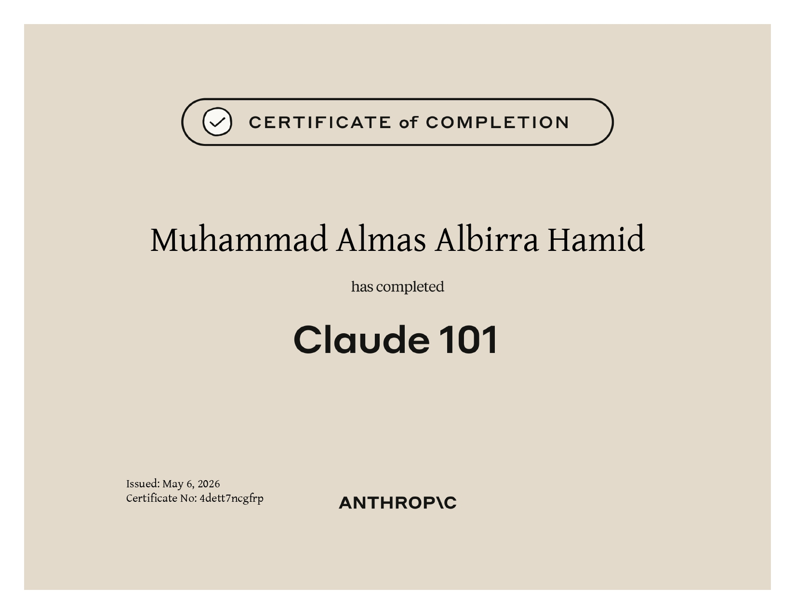
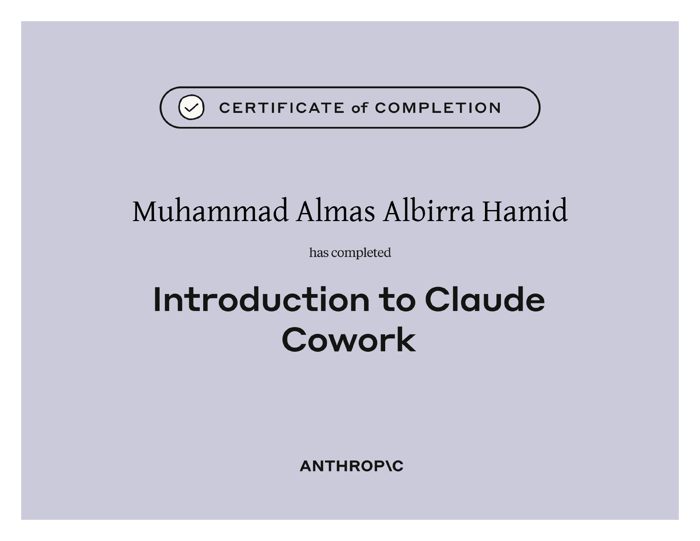
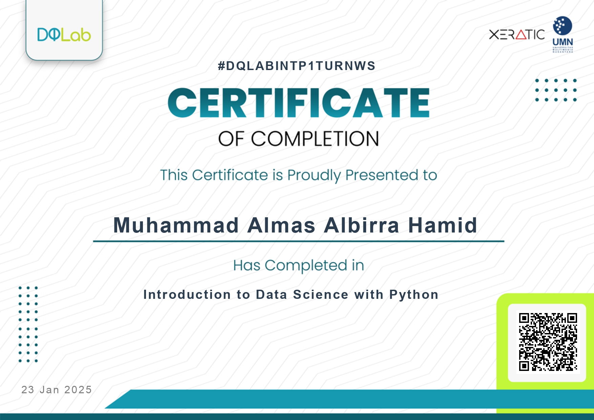
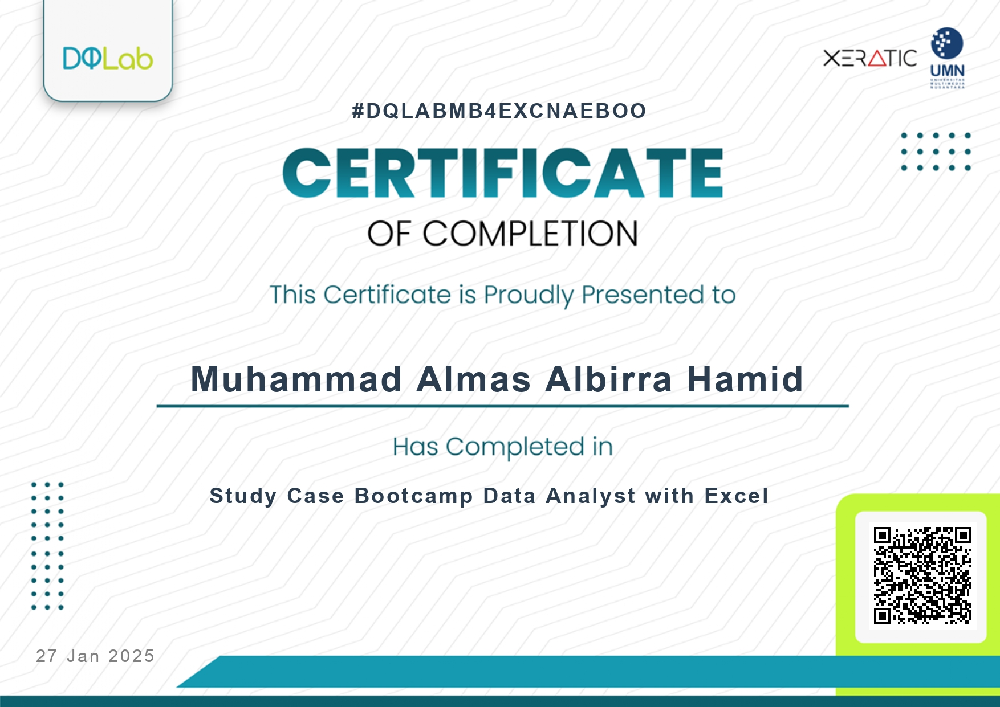
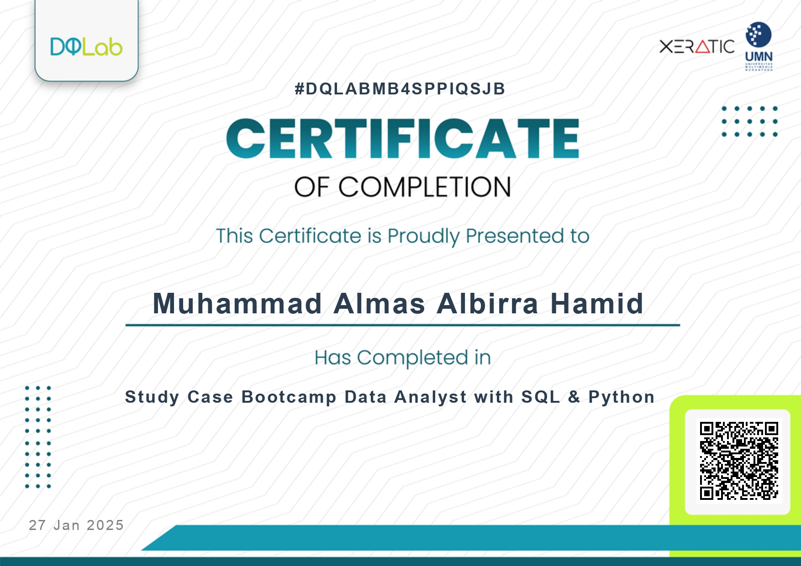
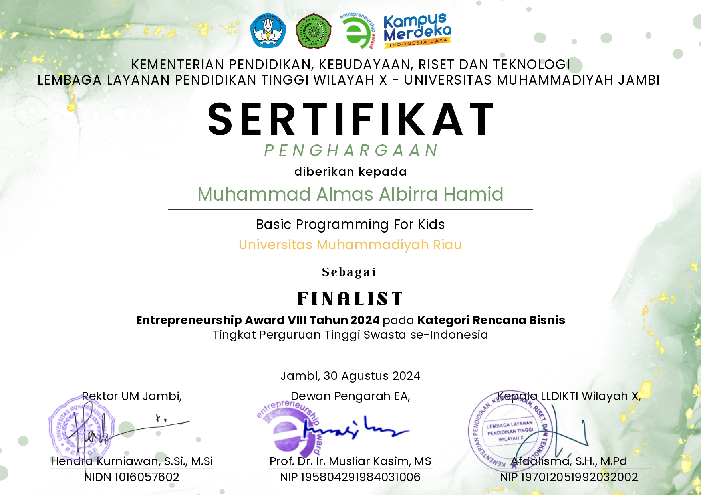
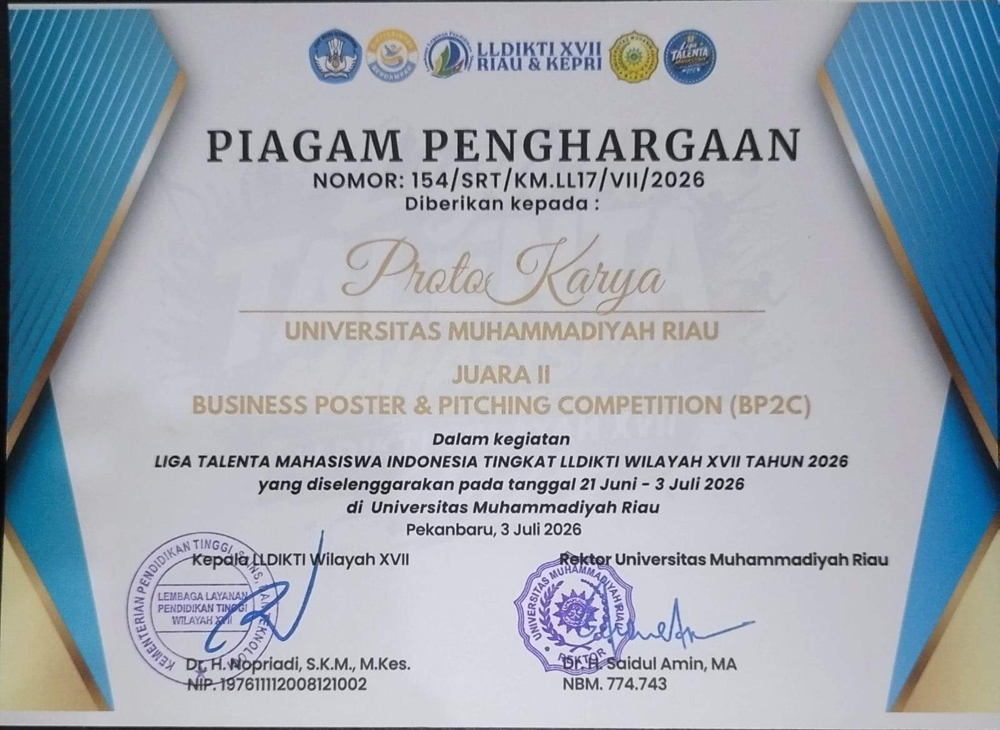
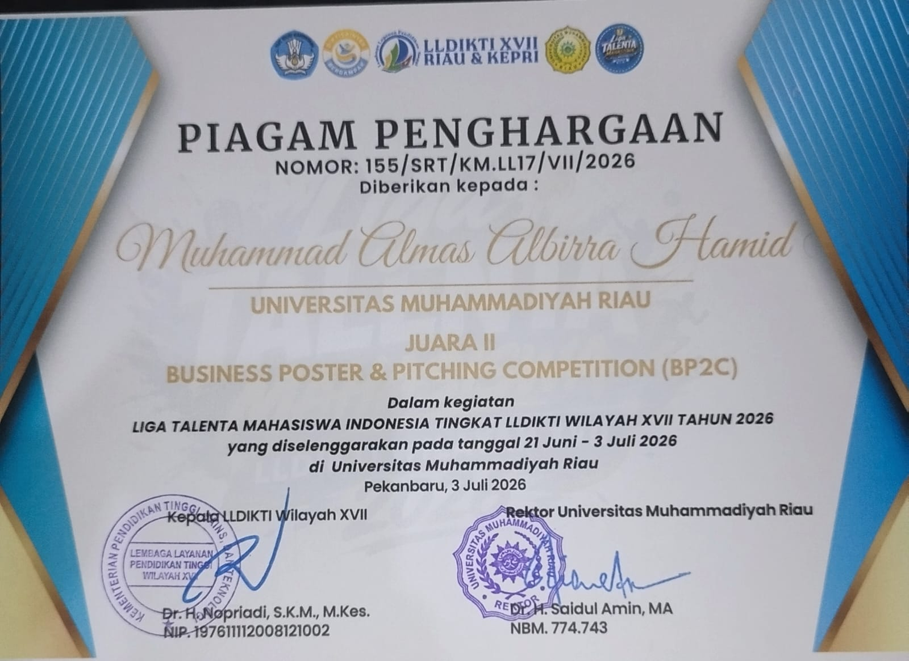

<h1 align="center">Muhammad Almas Albirra Hamid</h1>

<p align="center">
  <b>AI Engineer • Computer Vision • Efficient AI & Edge Deployment</b><br>
  <sub>Backed by Software Engineering, Networking, Cybersecurity & AIoT</sub>
</p>

<p align="center">
  
</p>

<p align="center">
  
  
  
  
</p>

<p align="center">
  <a href="mailto:seriesmomoru@gmail.com"></a>
  <a href="https://www.linkedin.com/in/muhammad-almas-albirra-hamid-3812202b8"></a>
  <a href="https://x.com/Mr_Momoru"></a>
  <a href="https://discord.com/users/monarch7894"></a>
</p>

<br>

## About

I build systems at the intersection of **Computer Vision, Applied AI, and Software Engineering** — from training and evaluating models to shipping the APIs, dashboards, and infrastructure that put them in front of users. My main technical interest is **efficient, real-time object detection** and edge deployment; my day-to-day shipped work is full-stack AI applications (FastAPI + Next.js), local-first AI tooling, and security utilities.

That work is backed by a full-stack engineering background (FastAPI, Laravel, Next.js, Flask) and a growing foundation in **Linux systems, networking, IoT, and cybersecurity tooling** — because a model is only useful once it's running inside a real system: an API, a database, a server, a network, a device.

```
MODEL → CODE → API → DATABASE → SERVER → NETWORK → SECURITY → EDGE DEVICE
```

I'm an Informatics Engineering student at **Universitas Muhammadiyah Riau**, currently deepening applied AI research and open-source tooling that connects model development to the systems AI actually runs on.

<br>

## Current Focus

```text
AI            → Object detection (YOLO), transfer learning, model evaluation, Grad-CAM
Engineering   → FastAPI model-serving, Next.js frontends, Redis/RQ workers, Docker, GitHub Actions CI
Deployment    → Local-first / self-hosted AI apps; ONNX / TensorRT / edge inference (developing)
Systems       → Linux, networking fundamentals, AIoT, server dashboards & monitoring
Security      → Python security utilities, reverse-engineering tooling, coordinated-messaging analysis
Research      → Reproducible experiments, architecture comparison, benchmarking
```

**Shipping / recently shipped**
```text
🐝  Stingers — 100% local AI chatbot: streaming SSE, 119 models via 9Router, RAG & memory
🌉  Bifrost-gateway — self-hosted LLM routing gateway (OpenAI + Anthropic-compatible endpoints)
🔭  OpenReframe — AI media reframing platform; core image/video pipeline working end-to-end
🌿  AgroVision-AI — leaf-photo plant disease diagnosis (working MVP, 88.5% test accuracy)
🌾  CropYield-AI — crop yield prediction from climate & land data (working MVP, R² 0.984)
🌦️  Weather Risk Prediction — Sumatera (NASA POWER + NOAA, Prophet + SVM)
🩺  Retinal OCT Classification — ResNet50 vs EfficientNetV2S vs DenseNet121 with Grad-CAM
🗄️  Mneme — local-first Markdown knowledge vault (Rust/Tauri + React)
🌐  ProtoKarya Hub & 🏢 Creativ Potlot — full-stack client/competition projects (Next.js)
```

<br>

## Technical Expertise

<table>
<tr>
<td valign="top" width="50%">

**AI / Computer Vision**
- CNNs, image classification, transfer learning & fine-tuning
- Object detection & tracking with YOLO (Ultralytics), OpenCV
- Classical ML pipelines: HOG/HSV feature extraction + Random Forest, gradient boosting, SVM
- Time-series forecasting with Prophet
- Model evaluation: accuracy, precision, recall, R², mAP
- Grad-CAM / explainable AI
- TensorFlow, Keras · scikit-learn · developing PyTorch
- Architecture comparison (ResNet50, EfficientNetV2S, DenseNet121)

**Efficient AI & Model Optimization (developing)**
- FP32 / FP16 / INT8 quantization, pruning, distillation
- Latency, FPS, model size & GFLOPs benchmarking
- ONNX, TensorRT, GPU inference

**AI Deployment & MLOps**
- FastAPI for model-serving backends
- Redis + RQ background workers for heavy CV jobs
- Docker, GitHub Actions CI, nginx
- Developing: MLflow, monitoring, end-to-end ML pipelines

**Applied AI Systems**
- LLM-backed chat applications: streaming (SSE), multi-model gateways, RAG pipelines, long-term memory
- Vector embeddings & cosine-similarity retrieval, document chunking, citation surfacing
- Multi-provider LLM routing with rate-limit-aware fallback
- Local-first / self-hosted AI architecture (no cloud lock-in)

**Classical AI & Research Foundations**
- Search & optimization: BFS/DFS, A*, heuristic search, TSP, graph coloring, genetic algorithms, simulated annealing
- Experimental method: hypotheses, baselines, comparison studies, reproducibility

</td>
<td valign="top" width="50%">

**Software Engineering**
- Python, PHP, JavaScript/TypeScript, Dart, Rust (Tauri, via Mneme), Bash, SQL
- OOP, REST API design, backend & frontend architecture, Git/GitHub
- Backend: FastAPI, Flask, Laravel, Node.js/Express, PostgreSQL, MySQL, SQLite, Prisma, Supabase, SQLAlchemy
- Frontend: Next.js, React, Tailwind CSS, Chart.js, plain HTML/CSS/JS UI components
- Mobile: Flutter / Dart (GetX)

**Networking & Systems**
- TCP/IP, HTTP/HTTPS, REST & MQTT-based communication
- Linux, VPS provisioning & remote server management
- Server / NOC monitoring dashboards
- Developing: DNS, routing fundamentals, structured network troubleshooting

**Cybersecurity & Tooling**
- Reverse engineering & deobfuscation tooling (Obfuscope, ObfuscopeV2)
- Coordinated-messaging analysis CLI (Momoru-Hunter-V4)
- VPS/server hardening & security tooling (security-toolkit-vps)
- Python security utilities: port & network scanners, password-strength checker, file-integrity checker, log analyzer, URL phishing detector, encryption tool
- CTF-oriented, authorized security research only

**AIoT / Edge Computing**
- Arduino, ESP32, LoRa, sensor integration
- Flask-based IoT monitoring dashboards
- Hardware ↔ software product design
- Developing: Raspberry Pi, NVIDIA Jetson, MQTT telemetry pipelines, edge inference

</td>
</tr>
</table>

<br>

### Technical Maturity

```text
CORE
Python · Computer Vision · FastAPI · Next.js
TensorFlow/Keras · scikit-learn · Git/GitHub

APPLIED
Object Detection (YOLO + OpenCV) · Transfer Learning · Grad-CAM · Model Evaluation
Redis/RQ workers · Docker · REST API · Laravel · Flask · Linux
LLM Chat Apps (SSE, RAG, Memory) · LLM Gateways · Security Utilities in Python

DEVELOPING
PyTorch · ONNX · TensorRT · Quantization · Pruning · Knowledge Distillation
MLflow · MLOps · Edge AI · GPU Inference
Networking Fundamentals · AIoT (ESP32/Jetson/Raspberry Pi/MQTT)
```

<br>

## Research Interests

Efficient object detection · model compression (quantization, pruning, distillation) · real-time computer vision · edge AI · explainable AI · AIoT · reproducible ML experiments · model benchmarking

*Supporting:* AI systems infrastructure · applied LLM/RAG applications · network-aware application design · cybersecurity automation

<br>

## Tech Stack

**AI / ML**


`Python` `TensorFlow` `Keras` `PyTorch (developing)` `Ultralytics/YOLO` `OpenCV` `Scikit-learn` `Prophet` `NumPy` `Pandas` `Matplotlib`

**AI Optimization / Deployment**

`Docker` `FastAPI` `Redis / RQ` `GitHub Actions` `Linux` `ONNX (developing)` `TensorRT (developing)` `MLflow (developing)` `GPU Inference (developing)`

**Applied AI / LLM Apps**

`Streaming SSE` `RAG` `Vector Embeddings` `LLM Gateways (OpenAI / Anthropic-compatible)` `Long-term Memory`

**Programming**

`Python` `PHP` `JavaScript` `TypeScript` `Dart` `Rust (via Mneme)` `Bash` `SQL`

**Backend & Database**


`FastAPI` `Flask` `Laravel` `Node.js / Express` `PostgreSQL` `MySQL` `SQLite` `SQLAlchemy` `Prisma` `Supabase`

**Frontend**


**Networking**

`TCP/IP` `HTTP/HTTPS` `REST` `MQTT` `Linux Networking` `VPS`

**Cybersecurity**


`Reverse Engineering` `Deobfuscation` `Python Security Scripting` `Network Scanning` `Server Hardening`

**IoT / Embedded**


`ESP32` `Arduino` `LoRa` `MQTT` `Raspberry Pi (developing)` `NVIDIA Jetson (developing)`

**Mobile**


**DevOps / Tools**


<br>

## Featured Projects

**AI / Computer Vision**

| Project | Description | Stack |
|---|---|---|
| 🐝 **[Stingers](https://github.com/Momoru2002/Stingers)** *(formerly MyAIChat)* | 100% local, ChatGPT-like AI chatbot — real-time SSE streaming, 119 models via a 9Router gateway, document RAG with citations, and long-term memory | FastAPI · SQLAlchemy · Next.js · TypeScript · Tailwind · SQLite |
| 🧠 **[OpenReframe](https://github.com/Momoru2002/OpenReframe)** | Open-source platform that reframes images and video into new aspect ratios while keeping the subject in frame. Core pipeline works end-to-end: YOLO subject detection, image smart-crop, async video reframing, upload/preview UI. Roadmap: SAM masks, outpainting | FastAPI · YOLO · OpenCV · ffmpeg · Redis/RQ · Next.js · Docker · nginx · GitHub Actions |
| 🌿 **[AgroVision-AI](https://github.com/Momoru2002/AgroVision-AI)** | Plant disease diagnosis from a single leaf photo — returns crop, condition, confidence, description and treatment advice. Working MVP covering 13 conditions across 4 crops (Tomato, Potato, Apple, Corn) on the PlantVillage dataset, ~88.5% test accuracy. Roadmap: full 38-class dataset and CNN backend | FastAPI · Next.js · scikit-learn (HOG + HSV features, Random Forest) |
| 🌾 **[CropYield-AI](https://github.com/Momoru2002/CropYield-AI)** | Crop yield (tons/hectare) prediction from country, crop, year, rainfall, pesticide use and temperature — trained on 28,242 FAO/World Bank records across 101 countries and 10 crops (test R² 0.984) | FastAPI · Next.js · scikit-learn (HistGradientBoosting) |
| 🩺 **[retinal-oct-classification](https://github.com/Momoru2002/retinal-oct-classification)** | Final-project study comparing ResNet50, EfficientNetV2S and DenseNet121 for classifying 8 retinal conditions from OCT scans, using transfer learning, fine-tuning and Grad-CAM explainability | Jupyter Notebook · TensorFlow/Keras |
| 🌦️ **[Weather Risk Prediction — Sumatera](https://github.com/Momoru2002/Weather-Risk-Prediction-Sumatera)** | End-to-end pipeline: NASA POWER + NOAA GHCN data → 30-day Prophet forecast → SVM classification into AMAN / WASPADA / BAHAYA risk levels | Prophet · Scikit-learn (SVM) · Pandas · Python |

**Developer Tools & Infrastructure**

| Project | Description | Stack |
|---|---|---|
| 🌉 **[Bifrost-gateway](https://github.com/Momoru2002/Bifrost-gateway)** | Local, self-hosted AI routing gateway — OpenAI-compatible `/v1/chat/completions` plus a native Anthropic `/v1/messages` endpoint (for tools like Claude Code) in front of multiple LLM providers/accounts (OpenAI, Anthropic, Gemini), with rate-limit-aware automatic fallback, weighted/least-cost routing, usage & cost logs, a local dashboard, and encrypted cloud sync via a private GitHub Gist | Node.js · Express · `node:sqlite` |
| 🗄️ **[Mneme](https://github.com/Momoru2002/Mneme)** | Local-first knowledge vault (fork of Mimir) — plain-Markdown notes with full-text search, templates, RBAC, audit log, and opt-in LAN web access | Rust (Tauri) · React · TypeScript · SQLite |
| 📊 **[advanced-server-dashboard](https://github.com/Momoru2002/advanced-server-dashboard) · [elite-noc-dashboard](https://github.com/Momoru2002/elite-noc-dashboard) · [Dashboard-server](https://github.com/Momoru2002/Dashboard-server)** | Server / NOC-style monitoring dashboards | Python · JavaScript |
| 🌡️ **[smart-iot-monitor](https://github.com/Momoru2002/smart-iot-monitor)** | Real-time IoT dashboard (temperature, humidity, energy usage, air quality) with a Flask API and live Chart.js charts; MQTT / ESP32 integration planned | Flask · JavaScript · Chart.js |

**Software Engineering**

| Project | Description | Stack |
|---|---|---|
| 🌐 **ProtoKarya Hub** *(private repo)* | Full-stack platform for an electronics/PCB prototyping business — PCB price configurator, guest/member ordering, order tracking, admin dashboard with analytics | Next.js 15 · Supabase (Postgres + Auth) · Tailwind CSS |
| 🏢 **Creativ Potlot** *(private repo)* | Official company website with bilingual (ID/EN) content, product & portfolio catalogs, RFQ/contact flow, admin dashboard | Next.js 15 · TypeScript · Prisma · PostgreSQL · next-intl |
| 📱 **[SITUMA](https://github.com/Momoru2002/SITUMA)** | *Sistem Tugas Mahasiswa* — mobile app for tracking coursework, UTS/UAS, and thesis/final-project progress, with deadline reminders and on-device storage (academic project) | Flutter · Dart · GetX · GetStorage |

**Cybersecurity**

| Project | Description | Stack |
|---|---|---|
| 🔎 **[Obfuscope](https://github.com/Momoru2002/Obfuscope) / [ObfuscopeV2](https://github.com/Momoru2002/ObfuscopeV2)** | Universal deobfuscation & binary analysis toolkit — decoding, inspecting, and reversing encoded/obfuscated data with automatic detection; V2 is a modern reverse-engineering workspace for analyzing unknown payloads | TypeScript |
| 🕵️ **[Momoru-Hunter-V4](https://github.com/Momoru2002/Momoru-Hunter-V4)** | Automated anti-buzzer intelligence system — a modular CLI for analyzing publicly accessible online conversations and flagging potential coordinated messaging patterns; plugin architecture, similarity analysis, JSON/CSV/HTML report export, Pytest + GitHub Actions CI | Python |
| 🛡️ **[security-toolkit-vps](https://github.com/Momoru2002/security-toolkit-vps)** | Security toolkit for VPS/server hardening & monitoring | Python |
| 🧰 **Python security utilities** — [port-scanner-python](https://github.com/Momoru2002/port-scanner-python), [network-scanner](https://github.com/Momoru2002/network-scanner), [password-strength-checker](https://github.com/Momoru2002/password-strength-checker), [file-integrity-checker](https://github.com/Momoru2002/file-integrity-checker), [log-analyzer](https://github.com/Momoru2002/log-analyzer), [url-phishing-detector](https://github.com/Momoru2002/url-phishing-detector), [encryption-tool](https://github.com/Momoru2002/encryption-tool), [bruteforce-simulator](https://github.com/Momoru2002/bruteforce-simulator), [cyber-toolkit-cli](https://github.com/Momoru2002/cyber-toolkit-cli), [system-monitor-cli](https://github.com/Momoru2002/system-monitor-cli) | Small educational CLI tools for authorized testing and learning | Python |

**Other Small Projects**

| Project | Description | Stack |
|---|---|---|
| 🤖 **[ai-spam-classifier](https://github.com/Momoru2002/ai-spam-classifier) · [ai-sentiment-analysis](https://github.com/Momoru2002/ai-sentiment-analysis)** | Beginner NLP classification projects | Python |
| 📈 **[data-sales-analysis](https://github.com/Momoru2002/data-sales-analysis) · [data-visualization-dashboard](https://github.com/Momoru2002/data-visualization-dashboard)** | Data analysis and visualization exercises | Python |
| 🎨 **UI component practice** — [dashboard-admin-ui](https://github.com/Momoru2002/dashboard-admin-ui), [auth-system-ui](https://github.com/Momoru2002/auth-system-ui), [ecommerce-product-page](https://github.com/Momoru2002/ecommerce-product-page), [music-player-ui](https://github.com/Momoru2002/music-player-ui), [weather-app-ui](https://github.com/Momoru2002/weather-app-ui), and more | Front-end UI exercises (glassmorphism, neumorphism, dark mode, animated navbar, etc.) | HTML · CSS · JS |

<br>

## Open Source Contributions

Forks I work from for upstream contributions and study: [freeCodeCamp](https://github.com/Momoru2002/freeCodeCamp), [maigret](https://github.com/Momoru2002/maigret), [local-deep-research](https://github.com/Momoru2002/local-deep-research), [Octop](https://github.com/Momoru2002/Octop), [open-code-review](https://github.com/Momoru2002/open-code-review), [claude-mem](https://github.com/Momoru2002/claude-mem), [uptime-kuma](https://github.com/Momoru2002/uptime-kuma), [excalidraw](https://github.com/Momoru2002/excalidraw), [tiptap](https://github.com/Momoru2002/tiptap).

Recent contributions to external open-source projects:

| Project | Contribution | Status |
|---|---|---|
| 🎓 **[freeCodeCamp/freeCodeCamp](https://github.com/freeCodeCamp/freeCodeCamp)** | [#70189](https://github.com/freeCodeCamp/freeCodeCamp/pull/70189) — corrected a curriculum lesson title/formatting mismatch in the Python conditionals lecture (closed [#70166](https://github.com/freeCodeCamp/freeCodeCamp/issues/70166)) | ✅ Merged |
| 🕵️ **[soxoj/maigret](https://github.com/soxoj/maigret)** | [#3178](https://github.com/soxoj/maigret/pull/3178) — reused HTTP connectors across checks and added backoff/retry on 429/503 responses | 🔄 Open — in review |
| 🕵️ **[soxoj/maigret](https://github.com/soxoj/maigret)** | [#3179](https://github.com/soxoj/maigret/pull/3179) — added a scheduled CI workflow to automate the project's existing (previously manual-only) database self-check | 🔄 Open — in review |

<sub>Table kept manually — update the status column as PRs get reviewed/merged.</sub>

<br>

## Achievements

| Award | Event | Year |
|---|---|---|
| 🥈 2nd Place — Business Poster & Pitching Competition (Project: ProtoKarya) | Liga Talenta Mahasiswa Indonesia — LLDIKTI XVII | 2026 |
| 🏅 Finalist | Entrepreneurship Award VIII | 2024 |

<br>

## Certifications

<p align="center">
  <table>
    <tr>
      <td align="center" width="20%">
        <br/>
        <sub><b>Claude 101</b><br/>Anthropic</sub>
      </td>
      <td align="center" width="20%">
        <br/>
        <sub><b>Introduction to Claude Cowork</b><br/>Anthropic</sub>
      </td>
      <td align="center" width="20%">
        <br/>
        <sub><b>Guide to Learn Python with AI</b><br/>DQLab</sub>
      </td>
      <td align="center" width="20%">
        <br/>
        <sub><b>Guide to Learn SQL with AI</b><br/>DQLab</sub>
      </td>
      <td align="center" width="20%">
        <br/>
        <sub><b>Guide to Learn R with AI</b><br/>DQLab</sub>
      </td>
    </tr>
    <tr>
      <td align="center" width="20%">
        <br/>
        <sub><b>Intro to Data Science with Python</b><br/>DQLab</sub>
      </td>
      <td align="center" width="20%">
        <br/>
        <sub><b>Intro to Data Science with R</b><br/>DQLab</sub>
      </td>
      <td align="center" width="20%">
        <br/>
        <sub><b>Data Analyst with Excel</b><br/>DQLab</sub>
      </td>
      <td align="center" width="20%">
        <br/>
        <sub><b>Data Analyst with SQL & Python</b><br/>DQLab</sub>
      </td>
      <td align="center" width="20%">
        <br/>
        <sub><b>Sertifikat Lainnya</b><br/><i>Entrepreneurship Award</i></sub>
      </td>
    </tr>
    <tr>
      <td align="center" width="20%">
        <br/>
        <sub><b>ProtoKarya</b><br/>Liga Talenta Mahasiswa Indonesia — LLDIKTI XVII</sub>
      </td>
      <td align="center" width="20%">
        <br/>
        <sub><b>Juara 2 — Business Poster & Pitching</b><br/>Liga Talenta Mahasiswa Indonesia — LLDIKTI XVII</sub>
      </td>
    </tr>
  </table>
</p>

<br>

## GitHub Statistics

<p align="center">
  
  
</p>

<p align="center">
  
</p>

<p align="center">
  
</p>

<p align="center">
  <picture>
    <source media="(prefers-color-scheme: dark)" srcset="https://raw.githubusercontent.com/Momoru2002/Momoru2002/output/github-contribution-grid-snake-dark.svg">
    <source media="(prefers-color-scheme: light)" srcset="https://raw.githubusercontent.com/Momoru2002/Momoru2002/output/github-contribution-grid-snake.svg">
    
  </picture>
</p>

<br>

## Goals

- Build efficient, real-time computer vision systems and deploy them beyond prototypes
- Take model optimization (quantization, pruning, distillation) from experimentation to edge deployment
- Develop end-to-end, reproducible ML pipelines (training → serving → monitoring)
- Publish OpenReframe as a stable, documented open-source release (SAM masks, outpainting)
- Expand AgroVision-AI to the full 38-class PlantVillage dataset with a CNN backend, and evolve toward field data such as oil palm
- Extend Stingers with tool calling, an artifact canvas, and local voice input
- Strengthen networking and systems engineering fundamentals
- Grow a library of ethical hacking & security tooling for authorized research
- Publish technical write-ups on applied, reproducible AI research
- Continue contributing to established open-source projects (freeCodeCamp, maigret) alongside personal projects

<br>

## Support My Work

<p align="center">
  <a href="https://saweria.co/Momoru19">
    
  </a>
</p>

<br>

<p align="center">
<i>"I don't just build models — I build the systems they run on."</i>
</p>

<p align="center">
  <sub>Muhammad Almas Albirra Hamid · Informatics Engineering, Universitas Muhammadiyah Riau · Indonesia</sub>
</p>
